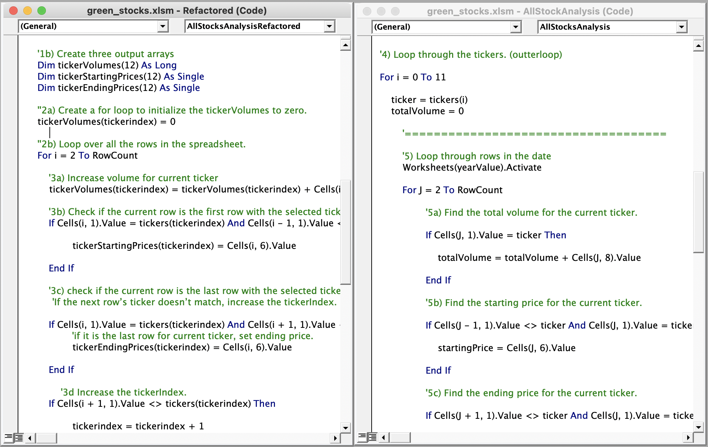
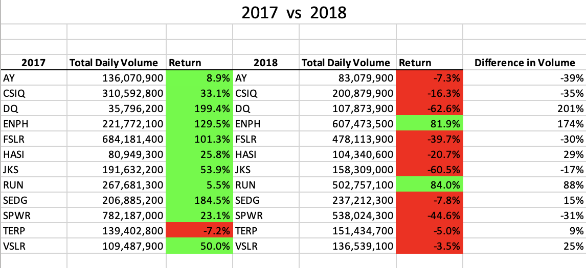
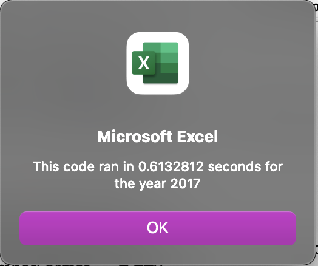
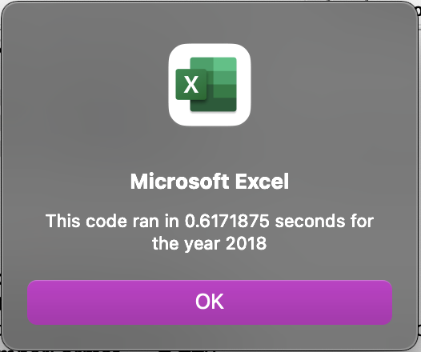
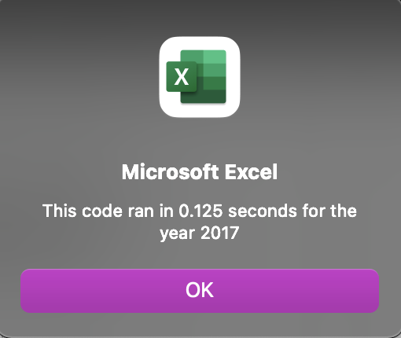
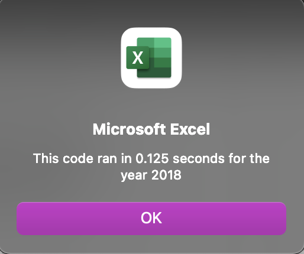

# Overview of Project

The purpose of this analysis is to find out if refactoring the "AllStocksAnalysis" macro will successfully make the VBA script run faster.

# Results

## Refactored vs Original Code

In this image we have the refactored code to the left and the original code to the right. Notice that the refactored code has been written to loop through a set of arrays as opposed to the original code looping through one ticker at a time.

## 2017 vs 2018 Stock Performance Analysis

Overall, 2017 was a good year for all stocks except TERP, which was the only stock that had a negative return of 7.2%. However, when you look at 2018, we can see a dramatic shift in total daily volumes and yearly returns among all stocks.

Let’s look at the top three tickers with significant increases in volume: DQ, ENPH, RUN.
- DQ had a sizable increase in daily volume, but a significant decrease in yearly returns compared to the previous year. This can be an indication of panic selling. Investors have a bearish view on the stock. Many investors are selling their assets while driving down the price of the stock. 
- ENPH and RUN also had a sizable increase in daily volume. Unlike DQ, the yearly return is significantly higher than the previous year. This indicates there is greater interests in these stocks, making them competitive and pushing the prices of the stocks higher.

## Execution Times 
The following screenshots show the time it took to run the original VBA script in comparison to the refactored VBA script.

### Original Times

- This screenshot was taken after running the original VBA script for the 2017 stock analysis.

- This screenshot was taken after running the original VBA script for the 2018 stock analysis.

### Refactored Times 

- This screenshot was taken after refactoring the code and running the VBA script for the 2017 stock analysis.

- This screenshot was taken after refactoring the code and running the VBA script for the 2018 stock analysis.

We were successfully able to refactor the code and make it run more efficiently by approximately .50 seconds faster!

# Summary

## What are the advantages or disadvantages of refactoring code?

The advantage of refactoring code is that you can optimize the code to process more data efficiently. This can be done by improving logic, including fewer steps, and using less memory. Another advantage is that refactoring codes can make it easier to maintain. When a code is more understandable, one can always come back and refactor to run the code even more efficiently. One disadvantage of refactoring code is that one might have lots of retesting for functionalities. 

## How do these pros and cons apply to refactoring the original VBA script?

Originally, the VBA script was looping through ticker by ticker and outputting data ticker by ticker. By refactoring the original VBA script, we were able to loop through arrays of tickers, tickerVolumes, tickerStartingPrices, and tickerEndingPrices. As a result, all the tickers and its parameters were being analyzed and outputted at the same time vs being analyzed ticker by ticker.

